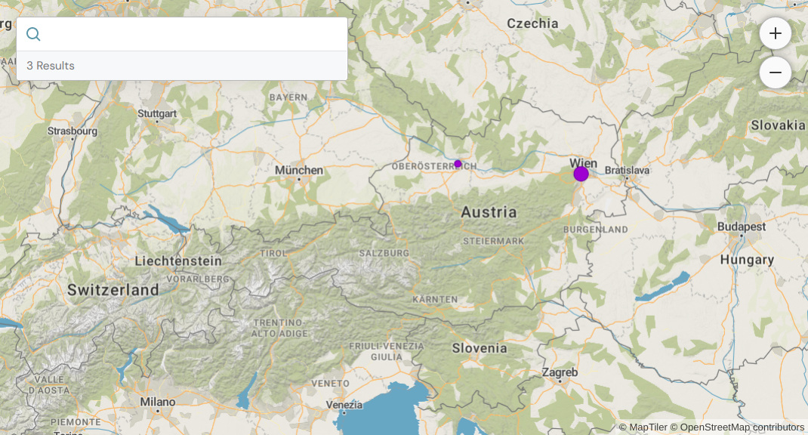

# Peripleo

> __Important:__ Peripleo is currently in alpha state. Many parts are still incomplete and under active development.

Peripleo is a React utility library that aims to simplify the development of map-based search and data visualization interfaces. 



Peripleo provides:

- an __architecture pattern__ and some useful helpers to simplify map application development
- a __library of React components__ useful when building map search interfaces

## Why not MapBox, MapLibre, etc.?

Peripleo is __not an alternative to existing map and geo-visualization libraries__ like [MapBox GL JS](https://www.mapbox.com/mapbox-gljs), [MapLibre](https://maplibre.org/) or [DeckGL](https://deck.gl/)! On the contrary: it uses these libraries under the hood, and complements them with additional utilities and UI components. Think of Peripleo as an add-on toolbox that helps you keep your development [DRY](https://en.wikipedia.org/wiki/Don%27t_repeat_yourself) when you build your next map application.

## Key Concepts

Applications built with Peripleo follow a specific design blueprint: 

- A __Store__ acts as the source of data. The store could be local, meaning that all data is loaded when the application starts. Or it could be an adapter to a remote database or API.
- The application has a global __Search State__, a set of query arguments and filters, usually defined by the user. The Search State defines which subset of data from the Store is currently presented in the UI.
- A __Search Adapter__ observes changes to the Search State, and retrieves new search results from the Store in response to the changes.
- The __Map__ visualizes the search results via different __Layers__.

Essentially, Peripleo is a [Model-View-Presenter](https://en.wikipedia.org/wiki/Model%E2%80%93view%E2%80%93presenter)
architecture for map applications: the __Store__ represents the model; the __Search Adapter__ acts as the presenter that translates the current search state into a result formatted for display; and the __Map__ is the view that visualizes the result. Within this architecture, Peripleo manages the plumbing between components, and provides interfaces for plugging  your own domain model into the application.

## Peripleo Hello World

Below is a minimal Peripleo application which:

- loads a list of two GeoJSON features into the `BrowserStore`
- enables text search on features' `properties.title` field
- instantiates a MapLibre map with a `PointLayer`
- adds a text search box and zoom buttons

```jsx
const features = [{
  "id": "http://sws.geonames.org/2772635",
  "type": "Feature",
  "properties": {
    "title": "Leonding"
  },
  "geometry": {
    "type": "Point",
    "coordinates": [14.2533, 48.27965]
  }
}, {
  "id": "http://sws.geonames.org/2771706",
  "type": "Feature",
  "properties": {
    "title": "Meidling"
  },
  "geometry": {
    "type": "Point",
    "coordinates": [16.33333, 48.16667]
  } 
}];

function App() {

  return (
    <Peripleo>
      <BrowserStore 
        nodes={features}
        index={['properties.title']}>

        <Map.MapLibre
          mapStyle="https://api.maptiler.com/maps/voyager/style.json?key={your-api-key}"
          defaultBounds={[[-15.764914, 33.847608], [35.240991, 58.156214]]}>

          <PointLayer 
            id="sample-point-layer"
            color="#9d00d1" 
            sizes={[
              1, 4,
              4, 18
            ]} />

        </Map.MapLibre>

        <Controls>
          <SearchBox />
          <ZoomControl />
        </Controls>
      </BrowserStore>
    </Peripleo>
  )

}
```

## Components

[...]

## Writing Custom Stores

[...]


